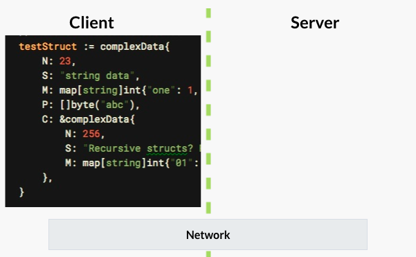

# Socket

Socket是网络编程的一个抽象概念，通常我们用一个 Socket 表示 “打开了一个网络连接”，在 Go 中 [net](https://golang.org/pkg/net/) 包对其进行了高度抽象，直接使用 `func Dial(network, address string) (Conn, error)` 就可轻松建立一个 Socket 连接。当 Socket 创建好了以后，我们可以利用 Scoket 进行 I/O 操作，当操作完毕后，需要对其进行关闭操作。

本章将从 TCP， UDP， Unix Domain Socket 入手，带领大家全面了解 Socket 在 Go 中的应用。

### 基本知识

Socket 连接又分为客户端和服务端，如图：



当连接创建后，我们可以在客户端或服务端对连接进行读/写操作，最后可以使用通关闭操作来断开连接，主要的步骤包括：

- 创建连接:

```go
Dial(network, address string) (Conn, error)
```

- 通过连接发送数据:

```
conn.Write([]byte("GET / HTTP/1.0\r\n\r\n"))
```

- 通过连接读取数据：

```
buf := make([]byte, 256)
conn.Read(buf)
```

- 关闭连接：

```
conn.Close()
```

>> 注意： `conn` 是一个 IO 对象，我们在实际环境中使用 IO 相关的帮助方法来进行读写操作。

### 实际例子之 google 首页访问

```golang
package main

import (
	"fmt"
	"io/ioutil"
	"log"
	"net"
)

func main() {
	// 尝试与 google.com:80 建立 tcp 连接
	conn, err := net.Dial("tcp", "google.com:80")
	if err != nil {
		log.Fatal(err)
	}

	defer conn.Close() // 退出关闭连接

	// 通过连接发送 GET 请求，访问首页
	_, err = fmt.Fprintf(conn, "GET / HTTP/1.0\r\n\r\n")
	if err != nil {
		log.Fatal(err)
	}

	dat, err := ioutil.ReadAll(conn)
	if err != nil {
		log.Fatal(err)
	}

	fmt.Println(string(dat))
}
```

当运行代码，可以得到 `google.com` 的首页内容，如下：

```
HTTP/1.0 200 OK
Date: Tue, 05 Jun 2018 14:45:30 GMT
Expires: -1
Cache-Control: private, max-age=0
Content-Type: text/html; charset=ISO-8859-1
P3P: CP="This is not a P3P policy! See g.co/p3phelp for more info."
Server: gws
X-XSS-Protection: 1; mode=block
X-Frame-Options: SAMEORIGIN
Set-Cookie: 1P_JAR=2018-06-05-14; expires=Thu, 05-Jul-2018 14:45:30 GMT; path=/; domain=.google.com
Set-Cookie: NID=131=mqkJocXSsDCD6zdcMyc12DCUqt3X19HIoS0HGTsAzsiuvFx56rBsliga5Uj22QyA8p2IZ6E7lkMGzchqam0RQ58PT6WV5Csllv80MO0uauY9P-FvzCLdYYY9tT0KYtVv; expires=Wed, 05-Dec-2018 14:45:30 GMT; path=/; domain=.google.com; HttpOnly
Accept-Ranges: none
Vary: Accept-Encoding
....
```

说明： google.com 网站后端是一个 HTTP server, 因为 HTTP 建立在 TCP 协议基础上，所以我们这里可以使用 TCP 协议来进行访问。

### TCP 操作

### UDP 操作

### Unix Domain 操作